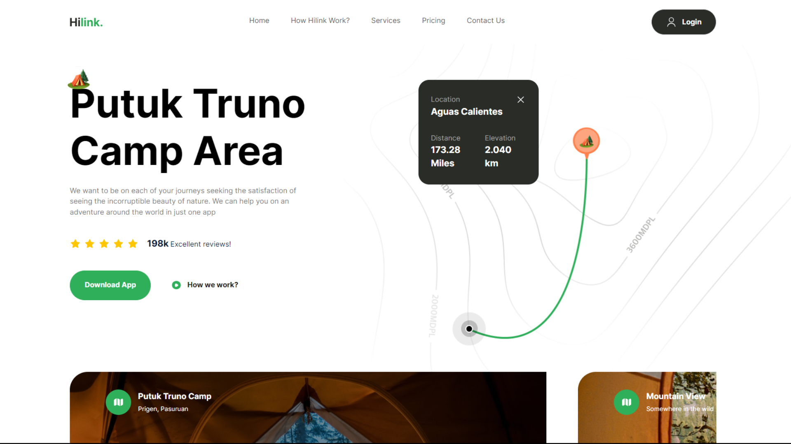
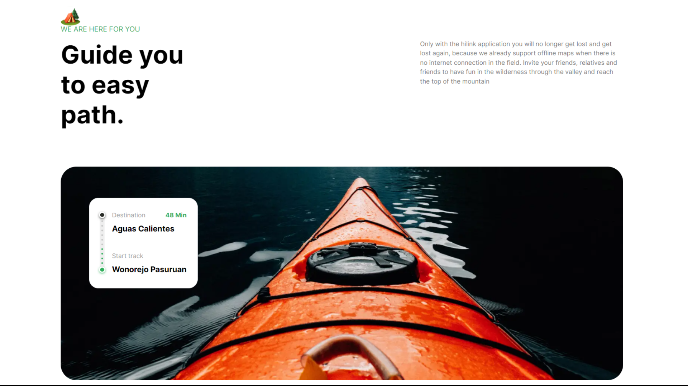

# Hilink
Fully responsive & modern UI/UX app of an travel agent.

## Tech Stack
• Reactjs
• Nextjs13
• TypeScript
• TailwindCSS

## Concepts
• TailwindCSS: Theme (Layout) Customization, Custom Styles using '@layer'
• TypeScript: Dynamic content via TS Constants
• React: Component-based Development to enhance reusability, modularity, and maintainability.

  

  

  

  

  

  

  

  

